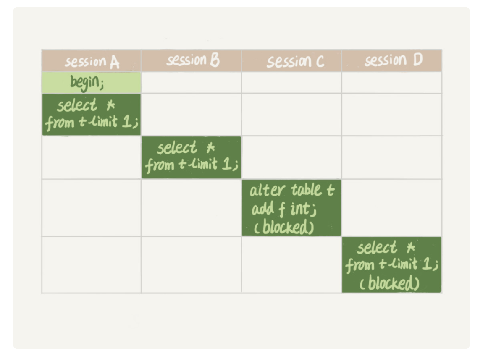

### 基本常识

- 一条sql查询语句的过程 ：

连接器 -> 分析器 -> 优化器 -> 存储引擎

分析器（词法分析、语法分析）做什么？怎么做

server层（连接器、分析器、优化器、执行器）

报语法错误一般是在语法分析这一步

- 一条sql更新语句的过程：

同样的连接器 -> 分析器 -> 优化器 -> 存储引擎

- 重要的日志模块（两阶段提交）
  1. redo log（innodb层，存储引擎层）记录的是物理操作
  2. bin log （server 层）记录的是逻辑操作

- 事务隔离（以InnoDB为例）ACID（原子性、一致性、隔离性、持久性）

  隔离性：

  	1. 读未提交：一个事务还未提交，它做的变更就能被别的事务看到
   	2. 读提交：一个事务提交后，它做的变更才会被其他事务给看到
   	3. 可重复读：一个事物执行过程中看到的数据和这个事务在启动时看到的数据是一致的。在可重复读事务下未提交变更，对其他事务也是不可见的
   	4. 串行化：对于同一行记录，写会加写锁，读会加读锁。出现读写冲突的时候，后访问的事务必须等待前一个事务访问完成，才能继续执行

### 索引

为什么采用B+树不用二叉树，数据不光存储在内存还存储在磁盘，为了尽量减少访问磁盘的次数，采用了B+树

#### 尽量的减少资源访问的原则

- innodb索引模型：每一个索引在InnoDB里面都对应一颗B+树，主键索引树对应的全量信息，其他索引B+树，对应的主键值，采用自增id避免页分裂和合并
- 覆盖索引：搜索普通索引的时候，直接select id from table where key =? 因为此时的key 索引B+树下面已经包含了主键key的值，就可以避免二次回表了。
- 最左前缀原则
- 索引下推：在普通索引中先判断，符合条件的再回表。

### 锁

> 给一个表加字段，或者修改字段或者加索引需要扫描全表数据。在对大表操作的时候需要特别小心，避免对线上服务造成影响。

#### 全局锁和表锁

表级锁：

1. lock table ... read/write：

   > 在线程A中执行 lock table t1 read, t2 write，其他线程写t1、读写t2的语句都会被阻塞。同时线程A自己本身，在执行unlock tables之前，也只能执行 t1 read、t2 write

2. MDL：不需要显式使用，在访问一个表的时候会被自动加上。

   > 读锁之间不互斥。读写锁之间和写锁之间有互斥

3. 如何给表加字段，这个有个特殊需要注意的地方。如果一个表数据量很大，并且查询比较频繁这个时候加字段需要注意。

sessionA 先启动，这个时候会对表t加一个MDL读锁，后面sessoionB启动也会加一个MDL读锁。之后sessonC被block，因为前面的se ssionA和sessionB读锁还未释放，这个时候sessionD也会被阻塞。如果这个表查询语句频繁，客户端有重试机制，那么也就是说超时后，会再起一个新的session请求，很快这个库的线程池就会被打爆。

那么如何给表加字段？

1. 查看是否有长事务

   > Information_schema库的innodb_trx表，查看当前执行的事务

2. alter table 设置等待时间，指定时间拿不到就先放弃后面找DBA再通过重试这个命令来解决

#### 行锁

> 引擎层各个引擎层自己实现的，InnoDB支持行锁
>
> InnonDB事务中，行锁是在需要的时候加上，但并不是不需要了就立刻释放，而是等待事务结束的时才释放。这就是两阶段锁协议

1. 两阶段锁

   > 涉及到行锁的，执行事务的时候放到最后开始执行

2. 死锁和死锁检测

   > 1. 超时时间来检测，innodb_lock_wait_timeout
   > 2. 发现死锁，主动回滚锁链条中的某一个事务，让其他事物可以正常执行，将innodb_deadlock_detect设为on

### 事务的隔离

事务可重复读

> 事务更新数据的时候，只能用当前读，如果当前记录的行锁被其他事务占用的话，就需要进入锁等待

总结：

1. 对于可重复读，查询只承认在事务启动之前就已经提交完成的数据
2. 对于读提交，查询只承认在语句启动之前就已经完成提交的数据

